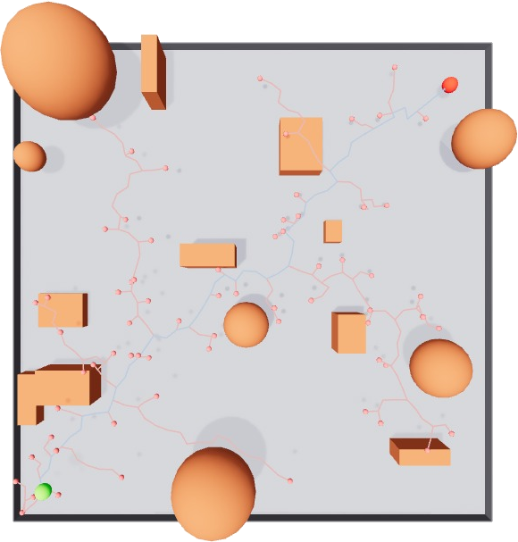
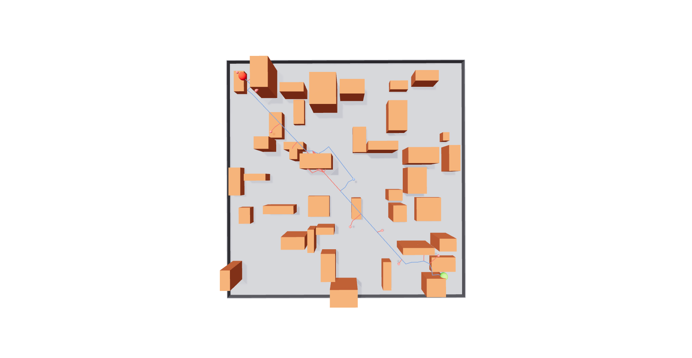
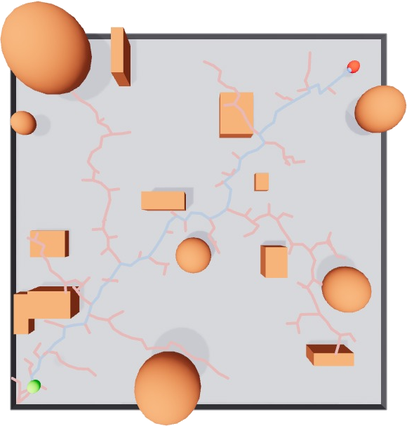
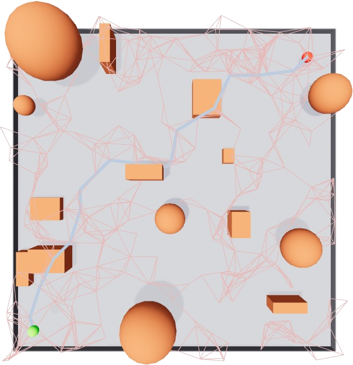

# Planning


A Python 3D path planning library with visualization using Viser. Implements pathplanning algorithms with a unified architecture for easy extension and consistent visualization.


## Features

- 🚀 **Unified Architecture**: All planners extend `RRTBase` or `RRGBase` for consistency
- 🎨 **Simple Visualization**: One API works for all planners - just pass the planner object
- 🌳 **Multiple Algorithms**: RRT (single-tree), RRT-Connect (bidirectional), RRG (graph-based), RRT* (optimal), and PRM (multi-query)
- 📊 **Detailed Analytics**: Track successful paths and failed collision attempts
- 📐 **N-Dimensional**: Works with any dimensional state space (2D, 3D, 4D+)
- 🎯 **Obstacle Avoidance**: Integrated collision detection with boxes and spheres
- ⚡ **Asymptotic Optimality**: RRT* and RRG converge to optimal solutions
- 🗺️ **Multi-Query Planning**: PRM builds reusable roadmaps for efficient path queries

## Requirements

- Python >= 3.10

## Installation

```bash
uv sync

# Install with dev dependencies (includes pytest)
uv sync --extra dev
```

## Examples

All visualization examples can be viewed at `http://localhost:8080` after running.

### 1. RRT (Rapidly-exploring Random Tree)

Basic single-tree RRT algorithm with obstacle avoidance.

**Paper**: [LaValle, S. M. (1998). "Rapidly-exploring random trees: A new tool for path planning"](https://msl.cs.illinois.edu/~lavalle/papers/Lav98c.pdf)



**Features:**
- Single-tree exploration from start to goal
- Real-time statistics (nodes explored, path length)

**Run:**
```bash
uv run python examples/rrt_star_example.py
```

---

### 2. RRT-Connect (Bidirectional RRT)

Faster convergence using dual-tree bidirectional search.

**Paper**: [Kuffner, J. J., & LaValle, S. M. (2000). "RRT-Connect: An efficient approach to single-query path planning"](https://www.cs.cmu.edu/afs/cs/academic/class/15494-s14/readings/kuffner_icra2000.pdf)



**Features:**
- Bidirectional search (start tree + goal tree)
- Faster convergence than single-tree RRT

**Run:**
```bash
uv run python examples/rrt_connect_example.py
```


---

### 3. RRG (Rapidly-exploring Random Graph)

An optimal sampling-based path planner that creates a graph structure to find increasingly shorter paths.

**Paper**: [Karaman, S., & Frazzoli, E. (2011). "Sampling-based algorithms for optimal motion planning"](https://arxiv.org/pdf/1105.1186)


**Features:**
- Builds a graph to connect samples to multiple neighbors, enabling path optimization
- Converges toward an optimal solution as more samples are added
- Graph-based structure allows multiple paths

**Run:**
```bash
uv run python examples/rrg_example.py
```

---

### 4. RRT* (RRT-Star)

An asymptotically optimal variant of RRT that rewires the tree to find shorter paths.

**Paper**: [Karaman, S., & Frazzoli, E. (2011). "Sampling-based algorithms for optimal motion planning"](https://arxiv.org/pdf/1105.1186)



**Features:**
- Asymptotically optimal path planning (converges to optimal solution)
- Rewiring mechanism to minimize path cost
- Uses A* search on the final graph to extract the optimal path
- Combines exploration with optimization

**Run:**
```bash
uv run python examples/rrt_star_example.py
```

---

### 5. PRM (Probabilistic Roadmap Method)

A multi-query path planner that preprocesses the environment by building a roadmap, then efficiently answers path queries using graph search.

**Paper**: [Kavraki, L. E., et al. (1996). "Probabilistic roadmaps for path planning in high-dimensional configuration spaces"](https://www.cs.cmu.edu/~motionplanning/papers/sbp_papers/PRM/prmbasic_01.pdf)



**Features:**
- **Two-phase approach**: Preprocessing (roadmap construction) + Query (path search)
- **Multi-query efficiency**: Build once, query many times with different start/goal pairs
- **Uniform sampling**: Explores the free configuration space uniformly
- **Graph structure**: Uses A* to find optimal path in the roadmap
- **Reusable roadmap**: Same roadmap can answer multiple path planning queries

**How it works:**
1. **Learning Phase (Preprocessing)**:
   - Sample random collision-free configurations
   - Connect nearby samples with collision-free edges
   - Build a roadmap (graph) of the free space
2. **Query Phase**:
   - Connect start and goal to the roadmap
   - Use A* to find shortest path in the graph

**Run:**
```bash
uv run python examples/prm_example.py
```

---

## Testing

Run tests using pytest:

```bash
# Install dev dependencies
uv sync --extra dev

```

Run tests:
```bash
# Run all tests
uv run pytest tests/ -v

# Run specific test file
uv run pytest tests/test_rrt.py -v

```

## Static Type Checking and Linting

```bash
# Install dev dependencies
uv sync --extra dev

# Run mypy for static type checking
uv run mypy planning/ tests/ --ignore-missing-imports
# Run ruff for linting
uv run ruff check planning/ tests/
```

## Dependencies

- viser >= 1.0.13
- numpy

## Quick Start


```python
import numpy as np
import viser
from planning.map import Map
from planning.sampling import RRT, RRTConnect, RRTStar, RRTConfig, ObstacleCollisionChecker
from planning.visualization import RRTVisualizer

# Setup
server = viser.ViserServer()
map_env = Map(size=20, z_range=(0.5, 2.5))
map_env.visualize_bounds(server)
map_env.generate_obstacles(server, num_obstacles=10)

# Create planner (RRT, RRT-Connect, or RRT*)
rrt = RRT(
    start_state=np.array([-8.0, -8.0, 1.0]),
    goal_state=np.array([8.0, 8.0, 2.0]),
    bounds=map_env.get_bounds(),
    collision_checker=ObstacleCollisionChecker(map_env.obstacles),
    config=RRTConfig(seed=42)
)

# Plan path
path = rrt.plan()

# Visualize (unified API for all planners!)
visualizer = RRTVisualizer(server)
visualizer.visualize_start_goal(rrt.start_state, rrt.goal_state)
visualizer.visualize_branches(rrt)  # Just pass the planner!

# Get statistics
stats = rrt.get_stats()
print(f"Explored {stats['num_nodes']} nodes")
print(f"Path length: {rrt.get_path_length():.2f}")
```

## Author

- Kim-JeongHan (Kim-JeongHan@naver.com)
