# Planning


A Python 3D path planning library with visualization using Viser. Implements pathplanning algorithms with a unified architecture for easy extension and consistent visualization.

## Requirements

- Python >= 3.10

## Installation

```bash
uv sync

# Install with dev dependencies (includes pytest)
uv sync --extra dev
```

## Examples

All visualization examples can be viewed at `http://localhost:8080` after running.

### 1. RRT (Rapidly-exploring Random Tree)

Basic single-tree RRT algorithm with obstacle avoidance.

**Paper**: [LaValle, S. M. (1998). "Rapidly-exploring random trees: A new tool for path planning"](https://msl.cs.illinois.edu/~lavalle/papers/Lav98c.pdf)

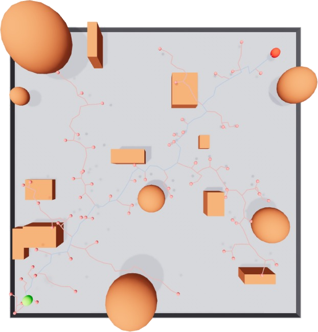

**Features:**
- Single-tree exploration from start to goal
- Real-time statistics (nodes explored, path length)

**Run:**
```bash
uv run python examples/rrt_example.py
```

---

### 2. RRT-Connect (Bidirectional RRT)

Faster convergence using dual-tree bidirectional search.

**Paper**: [Kuffner, J. J., & LaValle, S. M. (2000). "RRT-Connect: An efficient approach to single-query path planning"](https://www.cs.cmu.edu/afs/cs/academic/class/15494-s14/readings/kuffner_icra2000.pdf)


**Example comparison (seed 42, 30 mixed obstacles):**

| RRT | RRT-Connect |
| --- | --- |
| 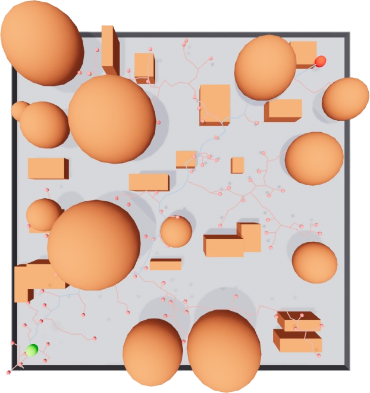 |  |
| Single tree grows from the start.<br/>First goal at iteration : 403<br/>Path length : 27.04<br/>Planning time : 0.527 seconds<br/>Waypoints : 56<br/>Explored nodes : 319 | Two trees grow from start and goal, then connect.<br/>Trees connected at iteration : 14<br/>Path length : 25.39<br/>Planning time : 0.020 seconds<br/>Waypoints : 52<br/>Total nodes : 77 |

RRT-Connect improves the time to first solution by growing two trees and repeatedly trying to connect them. It does not optimize the path like RRT*, but it can find a feasible connection much faster than single-tree RRT.

**Features:**
- Bidirectional search (start tree + goal tree)
- Faster convergence than single-tree RRT

**Run:**
```bash
uv run python examples/rrt_connect_example.py
```


---

### 3. RRG (Rapidly-exploring Random Graph)

An optimal sampling-based path planner that creates a graph structure to find increasingly shorter paths.

**Paper**: [Karaman, S., & Frazzoli, E. (2011). "Sampling-based algorithms for optimal motion planning"](https://arxiv.org/pdf/1105.1186)


**Example comparison (seed 42, 15 mixed obstacles):**

| RRT | RRG |
| --- | --- |
|  | 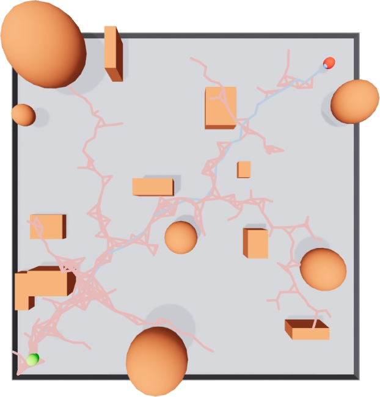 |
| Single tree grows from the start.<br/>First goal at iteration : 264<br/>Path length : 27.21<br/>Waypoints : 56<br/>Explored nodes : 250 | Graph grows from the start.<br/>Goal reached at iteration : 264<br/>Path length : 24.19<br/>Waypoints : 34<br/>Graph nodes : 249<br/>Graph edges : 725 |

RRG improves path-search structure rather than time to first solution. It keeps more collision-free connections than RRT, which gives the planner a graph to search for better routes. The tradeoff is more edge checks, more memory, and usually higher planning cost.

**Features:**
- Builds a graph to connect samples to multiple neighbors, enabling path optimization
- Converges toward an optimal solution as more samples are added
- Graph-based structure allows multiple paths

**Run:**
```bash
uv run python examples/rrg_example.py
```

---

### 4. RRT* (RRT-Star)

An asymptotically optimal variant of RRT that rewires the tree to find shorter paths.

**Paper**: [Karaman, S., & Frazzoli, E. (2011). "Sampling-based algorithms for optimal motion planning"](https://arxiv.org/pdf/1105.1186)

**Example comparison (seed 42):**

| RRT | RRT* |
| --- | --- |
|  | 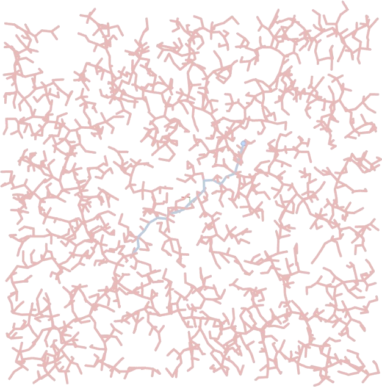 |
| Stops at the first feasible path.<br/>First goal at iteration : 264<br/>Path length : 27.21<br/>Waypoints : 56<br/>Explored nodes : 250 | Finds the first path, then continues optimizing.<br/>First goal at iteration : 264<br/>Optimized iterations : 2000<br/>Path length : 23.12<br/>Waypoints : 16<br/>Graph nodes : 1897 |

RRT* uses rewiring and a larger connection radius (`radius_gain=5.0` in this example) to replace long local branches with lower-cost connections. The result is slower than RRT, but the final path is shorter and has fewer waypoints.

**Features:**
- Asymptotically optimal path planning (converges to optimal solution)
- Rewiring mechanism to minimize path cost
- Uniform sampling over entire state space
- Combines exploration with optimization

**Run:**
```bash
uv run python examples/rrt_star_example.py
```

---

### 5. PRM (Probabilistic Roadmap Method)

A multi-query path planner that preprocesses the environment by building a roadmap, then efficiently answers path queries using graph search.

**Paper**: [Kavraki, L. E., et al. (1996). "Probabilistic roadmaps for path planning in high-dimensional configuration spaces"](https://www.cs.cmu.edu/~motionplanning/papers/sbp_papers/PRM/prmbasic_01.pdf)

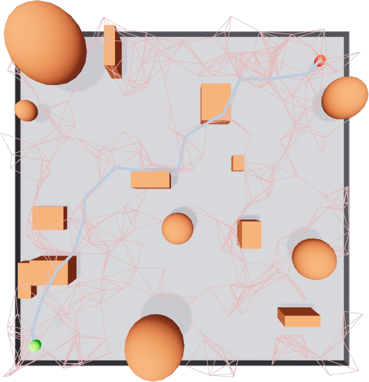

**Features:**
- **Two-phase approach**: Preprocessing (roadmap construction) + Query (path search)
- **Multi-query efficiency**: Build once, query many times with different start/goal pairs
- **Uniform sampling**: Explores the free configuration space uniformly
- **Graph structure**: Uses A* to find optimal path in the roadmap
- **Reusable roadmap**: Same roadmap can answer multiple path planning queries

**How it works:**
1. **Learning Phase (Preprocessing)**:
   - Sample random collision-free configurations
   - Connect nearby samples with collision-free edges
   - Build a roadmap (graph) of the free space
2. **Query Phase**:
   - Connect start and goal to the roadmap
   - Use A* to find shortest path in the graph

**Run:**
```bash
uv run python examples/prm_example.py
```

---

### 6. PRM* (Probabilistic Roadmap Method Star)

An asymptotically optimal variant of PRM that uses dynamic connection radius to guarantee convergence to the optimal solution.

**Paper**: [Karaman, S., & Frazzoli, E. (2011). "Sampling-based algorithms for optimal motion planning"](https://arxiv.org/pdf/1105.1186)

**Example comparison (seed 42, 15 mixed obstacles):**

| PRM | PRM* |
| --- | --- |
|  | 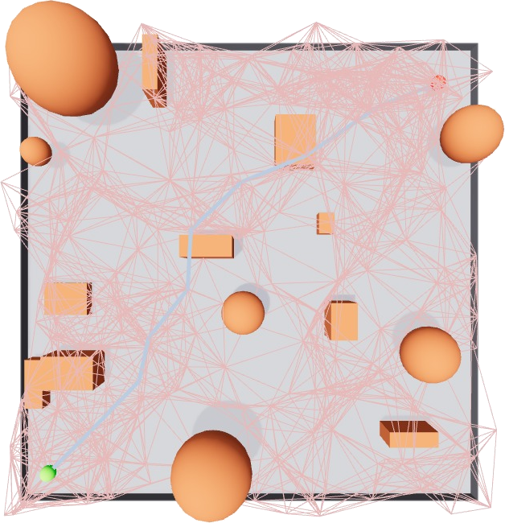 |
| Fixed connection radius : 2.0<br/>Sample number : 300<br/>Path length : 28.64<br/>Waypoints : 20<br/>Roadmap nodes : 282<br/>Roadmap edges : 1178 | Dynamic radius gain : 10.0<br/>Sample number : 300<br/>Path length : 24.48<br/>Waypoints : 11<br/>Roadmap nodes : 282<br/>Roadmap edges : 2594 |

PRM uses a fixed connection radius, while PRM* uses a radius that changes with the roadmap size. With a larger radius gain, PRM* finds a shorter path in this example, but it pays for that improvement with more roadmap edges and collision checks.

**Features:**
- **Asymptotic optimality**: Converges to the optimal path as samples increase
- **Dynamic radius**: Connection radius decreases as $r(n) = \gamma \left(\frac{\log n}{n}\right)^{1/d}$ where $n$ is the number of nodes and $d$ is the dimension
- **Multi-query efficiency**: Like PRM, supports multiple queries on the same roadmap
- **Optimal graph structure**: Balances connectivity and optimality

**Key Differences from PRM:**
- **PRM**: Uses fixed connection radius, no optimality guarantee
- **PRM***: Uses dynamic radius that shrinks with more samples, guarantees asymptotic optimality

**How it works:**
1. **Learning Phase**:
   - Sample random collision-free configurations
   - Connect each sample to neighbors within radius $r(n) = \gamma \left(\frac{\log n}{n}\right)^{1/d}$
   - Connection radius decreases as more samples are added
2. **Query Phase**:
   - Connect start and goal to the roadmap
   - Use A* to find shortest path in the optimal graph

**Run:**
```bash
uv run python examples/prm_star_example.py
```

---

### 7. Informed RRT* - Comparison with RRT*

Comparison of standard RRT* and its informed variant using the same seed, start/goal, obstacle map, max iterations, step size, and radius gain.

| **RRT* (RRT-Star)** | **Informed RRT*** |
|---------------------|-------------------|
| 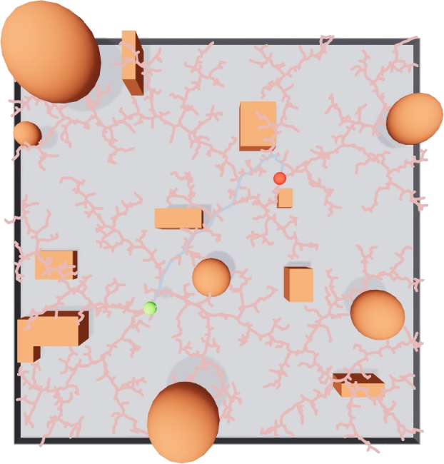 | 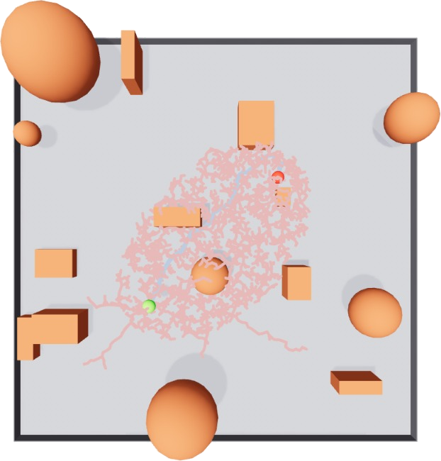 |
| Standard RRT* sampling with rewiring.<br/>First goal at iteration : 213<br/>Optimized iterations : 3000<br/>Path length : 11.01<br/>Planning time : 32 seconds<br/>Waypoints : 40<br/>Graph nodes : 2920<br/>Graph edges : 2919<br/>Goal candidates : 154 | Uses RRT* until a first solution exists, then samples inside the informed ellipsoid.<br/>Optimized iterations : 3000<br/>Path length : 11.01<br/>Planning time : 29 seconds<br/>Waypoints : 40<br/>Graph nodes : 2912<br/>Graph edges : 2911<br/>Goal candidates : 18 |

In this run, Informed RRT* does not find a shorter final path than RRT*. Both planners converge to the same path length and waypoint count, while Informed RRT* finishes slightly faster because its post-solution sampling focuses on states that can still improve the current best path.

#### What is Informed RRT*?

An improved version of RRT* that uses informed sampling within an ellipsoidal subset of the state space after a first solution is found. It can improve convergence speed in optimization-focused runs, but it does not guarantee a better path in every finite run.

**Paper**: [Gammell, J. D., et al. (2014). "Informed RRT*: Optimal sampling-based path planning focused via direct sampling of an admissible ellipsoidal heuristic"](https://arxiv.org/pdf/1404.2334)

**Features:**
- **Focused convergence**: Focuses sampling on regions that can improve the solution after a first path exists
- **Ellipsoidal sampling**: After finding initial solution, samples only within prolate hyperspheroid defined by start, goal, and current best cost
- **Asymptotic optimality**: Maintains optimality guarantee of RRT*
- **Informed search**: Uses geometric heuristic to reject samples that cannot improve the path

**How it works:**
1. **Phase 1 (Exploration)**: Uses uniform sampling like RRT* until first path is found
2. **Phase 2 (Exploitation)**: Samples only within ellipsoid where focus is on improving the current best solution
3. The ellipsoid is defined by:
   - Foci: start and goal states
   - Minor axis: determined by current best path cost
   - Only samples that could potentially improve the solution are considered

**Key Differences:**

| Aspect | RRT* | Informed RRT* |
|--------|------|---------------|
| **Sampling Strategy** | Uniform sampling over entire space throughout planning | Uniform initially, then focused ellipsoidal sampling after first solution |
| **Convergence Speed** | Explores the full space throughout planning | Can be faster after the first solution because sampling is focused |
| **Optimality** | Asymptotically optimal | Asymptotically optimal (same guarantee) |
| **When to Use** | Unknown environments, first solution priority | Known start/goal, optimization priority |

**Run:**
```bash
uv run python examples/informed_rrt_star_example.py
```

---

### 8. RRT*-R (Riemannian Metric RRT*)

Sampling planners with a configurable planning-space metric. The terrain example
keeps the planner in a 2D chart while edge costs follow the induced surface
metric of a 3D mountain terrain.

**Paper**: [Zhang, Y., Zhou, Q., & Yang, X.-S. "An RRT* algorithm based on Riemannian metric model for optimal path planning"](https://arxiv.org/html/2507.01697v1)

<table>
  <tr>
    <td><strong>RRT-Connect</strong><br/>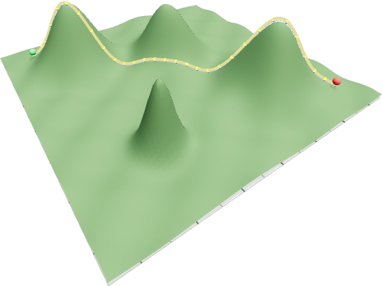</td>
    <td><strong>RRG</strong><br/>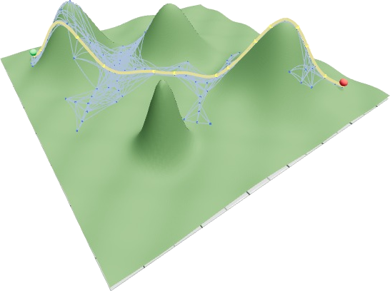</td>
  </tr>
  <tr>
    <td><strong>RRT*</strong><br/>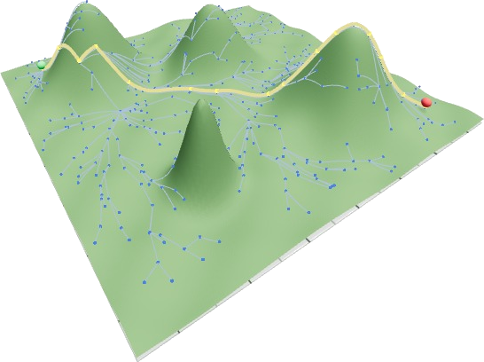</td>
    <td><strong>PRM*</strong><br/>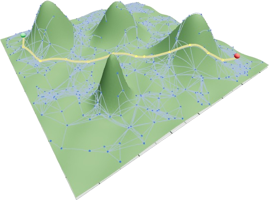</td>
  </tr>
</table>

**Features:**
- **Projection-plane planning**: plans in a 2D chart while measuring edge length with the Riemannian metric induced by the 3D terrain surface
- **Environment-aware edge cost**: steep height changes increase local curve length, so the planner prefers smoother terrain routes over short Euclidean shortcuts
- **RRT*-R cost model**: replaces Euclidean edge length with numerical Line-R cost while keeping the RRT* expansion, neighbor, and rewiring structure
- **Geodesic approximation goal**: searches for low-cost paths under the induced metric, matching the paper's framing of approximating shortest surface/geodesic distance

**Implementation additions:**
- **Reusable planning space**: `TerrainRiemannianSpace` plugs into `PlanningSpace`, so graph distance, steering, edge samples, and edge cost use one metric source
- **Planner comparison beyond the paper**: the same terrain metric can be run with RRT-Connect, RRG, RRT*, and PRM* for side-by-side behavior comparison
- **Matched visualization**: graph edges and final paths are rendered from `graph.edge_states(...)`, so displayed waypoints and local edge samples stay consistent

**Run:**
```bash
uv run python examples/rrt_star_r_example.py

# Choose a planner
uv run python examples/rrt_star_r_example.py --planner rrt-connect
uv run python examples/rrt_star_r_example.py --planner rrg
uv run python examples/rrt_star_r_example.py --planner rrt-star
uv run python examples/rrt_star_r_example.py --planner prm-star --samples 500

# Headless smoke run
uv run python examples/rrt_star_r_example.py --planner rrt-star --no-show --iterations 120
```

---

### 9. Diffuser (Guided Diffusion Planning)

Trajectory planning by reverse diffusion with value-guided sampling.
A diffusion model learns a trajectory prior from data, and a value model steers each
denoising step toward high-quality motions during reverse sampling (Algorithm 1).

In practice, the `diffusion_trajectory_one_shot_example.py` script uses endpoint inpainting
to clamp start and goal states at timestep boundaries and returns full batched trajectories in one call.

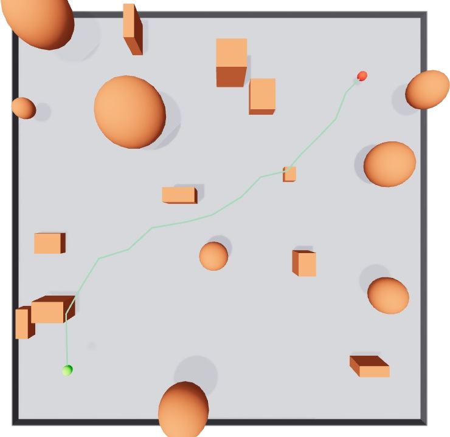

**Paper**: [Janner et al. (2022). "Planning with Diffusion for Flexible Behavior Synthesis"](https://github.com/jannerm/diffuser)

**Features:**
- **Diffusion prior learning**: trains a trajectory distribution model from motion examples
- **Value guidance**: guides the reverse process with a learned value network during sampling
- **One-shot generation**: returns full trajectory batches at once with fixed start/goal states
- **Simple endpoint constraints**: applies inpainting constraints directly in the denoising loop
- **Separate training stages**: diffusion and value networks can be trained independently

**Install dependencies:**
```bash
uv sync --extra dev --extra diffuser
```

**Full workflow (recommended):**

1. Generate a dataset from RRT rollouts.
2. Train the diffusion model.
3. Train the value model.
4. Run one-shot guided sampling.

```bash
uv run python scripts/generate_rrt_dataset.py \
  --output diffusion_demo_dataset_h16.npz \
  --horizon 16 --dataset-size 1000

uv run python scripts/train_diffusion.py --config config/diffusion_3d_training.yaml
uv run python scripts/train_value.py --config config/value_3d_training.yaml
uv run python examples/diffusion_trajectory_one_shot_example.py \
  --run-config config/diffusion_trajectory_one_shot.yaml
```

`--dataset-size` is the number of planning attempts. A larger value gives stronger coverage
(e.g., `1000+` for practical training; `200` can be used for quick smoke tests).

> Training configs:
> - Diffusion: `config/diffusion_3d_training.yaml`
> - Value: `config/value_3d_training.yaml`
> - Inference: `config/diffusion_trajectory_one_shot.yaml`

**Note:** Current value training uses a geometric proxy target (`log(1 + distance-to-goal)`),
without extra reward-correction reweighting during training.

---

## Testing

Run tests using pytest:

```bash
# Install dev + diffuser dependencies (required for diffuser tests)
uv sync --extra dev --extra diffuser

```

Run tests:
```bash
# Run all tests
uv run pytest tests/ -v

# Run specific test file
uv run pytest tests/test_rrt.py -v

```

## Static Type Checking and Linting

```bash
# Install dev dependencies
uv sync --extra dev

# Run mypy for static type checking
uv run mypy planning/ tests/ --ignore-missing-imports
# Run ruff for linting
uv run ruff check planning/ tests/
```

## Dependencies

- viser >= 1.0.13
- numpy

## Quick Start


```python
import numpy as np
import viser
from planning.map import Map
from planning.sampling import RRT, RRTConnect, RRTStar, PRM, PRMStar, RRTConfig, ObstacleCollisionChecker
from planning.visualization import RRTVisualizer

# Setup
server = viser.ViserServer()
map_env = Map(size=20, z_range=(0.5, 2.5))
map_env.visualize_bounds(server)
map_env.generate_obstacles(server, num_obstacles=10)

# Create planner (RRT, RRT-Connect, RRT*, PRM, or PRM*)
rrt = RRT(
    start_state=np.array([-8.0, -8.0, 1.0]),
    goal_state=np.array([8.0, 8.0, 2.0]),
    bounds=map_env.get_bounds(),
    collision_checker=ObstacleCollisionChecker(map_env.obstacles),
    config=RRTConfig(seed=42)
)

# Plan path
path = rrt.plan()

# Visualize (unified API for all planners!)
visualizer = RRTVisualizer(server)
visualizer.visualize_start_goal(rrt.start_state, rrt.goal_state)
visualizer.visualize_branches(rrt)  # Just pass the planner!

# Get statistics
stats = rrt.get_stats()
print(f"Explored {stats['num_nodes']} nodes")
print(f"Path length: {rrt.get_path_length():.2f}")
```

## Author

- Kim-JeongHan (Kim-JeongHan@naver.com)
