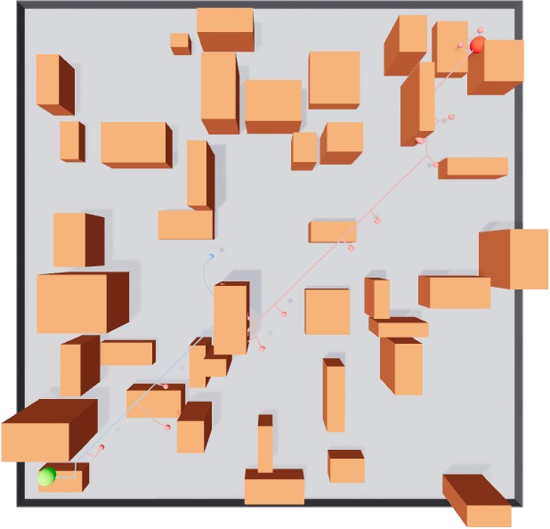

# Planning


A Python 3D path planning library with visualization using Viser. Implements pathplanning algorithms with a unified architecture for easy extension and consistent visualization.


## Features

- 🚀 **Unified Architecture**: All planners extend `RRTBase` for consistency
- 🎨 **Simple Visualization**: One API works for all planners - just pass the planner object
- 🌳 **Multiple Algorithms**: RRT (single-tree) and RRT-Connect (bidirectional)
- 📊 **Detailed Analytics**: Track successful paths and failed collision attempts
- 📐 **N-Dimensional**: Works with any dimensional state space (2D, 3D, 4D+)
- 🎯 **Obstacle Avoidance**: Integrated collision detection with boxes and spheres

## Requirements

- Python >= 3.10

## Installation

```bash
uv sync

# Install with dev dependencies (includes pytest)
uv sync --extra dev
```

## Examples

All visualization examples can be viewed at `http://localhost:8080` after running.

### 1. Obstacle Map Generation

Random procedural obstacle generation for testing.


**Features:**
- Random obstacle placement
- Configurable obstacle density
- Visualized boundaries

**Run:**
```bash
uv run python examples/obstacle_map_example.py
```

---

### 2. RRT (Rapidly-exploring Random Tree)

Basic single-tree RRT algorithm with obstacle avoidance.

**Paper**: [LaValle, S. M. (1998). "Rapidly-exploring random trees: A new tool for path planning"](https://msl.cs.illinois.edu/~lavalle/papers/Lav98c.pdf)


**Features:**
- Single-tree exploration from start to goal
- Blue branches: Successful path
- Red branches: Failed collision attempts
- Real-time statistics (nodes explored, path length)

**Run:**
```bash
uv run python examples/rrt_example.py
```

---

### 3. Mixed Obstacles (Boxes + Spheres)

RRT with heterogeneous obstacle types.


**Features:**
- Box obstacles (rectangular prisms)
- Sphere obstacles (3D balls)
- Combined collision checking

**Run:**
```bash
uv run python examples/rrt_mixed_obstacles_example.py
```

---

### 4. RRT-Connect (Bidirectional RRT)

Faster convergence using dual-tree bidirectional search.

**Paper**: [Kuffner, J. J., & LaValle, S. M. (2000). "RRT-Connect: An efficient approach to single-query path planning"](https://www.cs.cmu.edu/afs/cs/academic/class/15494-s14/readings/kuffner_icra2000.pdf)



**Features:**
- Bidirectional search (start tree + goal tree)
- Green branches: Start tree exploration
- Cyan branches: Goal tree exploration
- Blue line: Final connected path
- Red branches: Failed collision attempts

**Run:**
```bash
uv run python examples/rrt_connect_example.py
```

---

## Testing

Run tests using pytest:

```bash
# Install dev dependencies
uv sync --extra dev

```

Run tests:
```bash
# Run all tests
uv run pytest tests/ -v

# Run specific test file
uv run pytest tests/test_rrt.py -v

```

## Architecture

### Design Philosophy

This library follows a **clean, extensible architecture** based on object-oriented principles:

1. **Unified Base Class (`RRTBase`)**:
   - All RRT variants extend a common abstract base class
   - Ensures consistent API across different algorithms
   - Simplifies visualization and statistics collection

2. **Separation of Concerns**:
   - **Planning**: `planning.sampling` - algorithms and samplers
   - **Environment**: `planning.map` - obstacles and boundaries
   - **Graph**: `planning.graph` - tree nodes and relationships
   - **Visualization**: `planning.visualization` - rendering and display

3. **Pluggable Components**:
   - Collision checkers: Easy to add custom collision detection
   - Samplers: Switch between uniform, goal-biased, or custom sampling
   - Algorithms: Add new RRT variants by extending `RRTBase`

### Key Design Decisions

- **State-based nodes**: Use `node.state` (numpy arrays) for N-dimensional flexibility
- **Map-centric pattern**: `Map` class is the single source of truth for environment
- **Unified visualization**: One API (`visualize_branches(planner)`) works for all algorithms
- **Failed attempt tracking**: RRT-Connect records collision-blocked extensions for analysis

## Dependencies

- viser >= 1.0.13
- numpy

## Quick Start


```python
import numpy as np
import viser
from planning.map import Map
from planning.sampling import RRT, RRTConnect, RRTConfig, ObstacleCollisionChecker
from planning.visualization import RRTVisualizer

# Setup
server = viser.ViserServer()
map_env = Map(size=20, z_range=(0.5, 2.5))
map_env.visualize_bounds(server)
map_env.generate_obstacles(server, num_obstacles=10)

# Create planner (RRT or RRT-Connect)
rrt = RRT(
    start_state=np.array([-8.0, -8.0, 1.0]),
    goal_state=np.array([8.0, 8.0, 2.0]),
    bounds=map_env.get_bounds(),
    collision_checker=ObstacleCollisionChecker(map_env.obstacles),
    config=RRTConfig(seed=42)
)

# Plan path
path = rrt.plan()

# Visualize (unified API for all planners!)
visualizer = RRTVisualizer(server)
visualizer.visualize_start_goal(rrt.start_state, rrt.goal_state)
visualizer.visualize_branches(rrt)  # Just pass the planner!

# Get statistics
stats = rrt.get_stats()
print(f"Explored {stats['num_nodes']} nodes")
print(f"Path length: {rrt.get_path_length():.2f}")
```

## Author

- Kim-JeongHan (Kim-JeongHan@naver.com)
